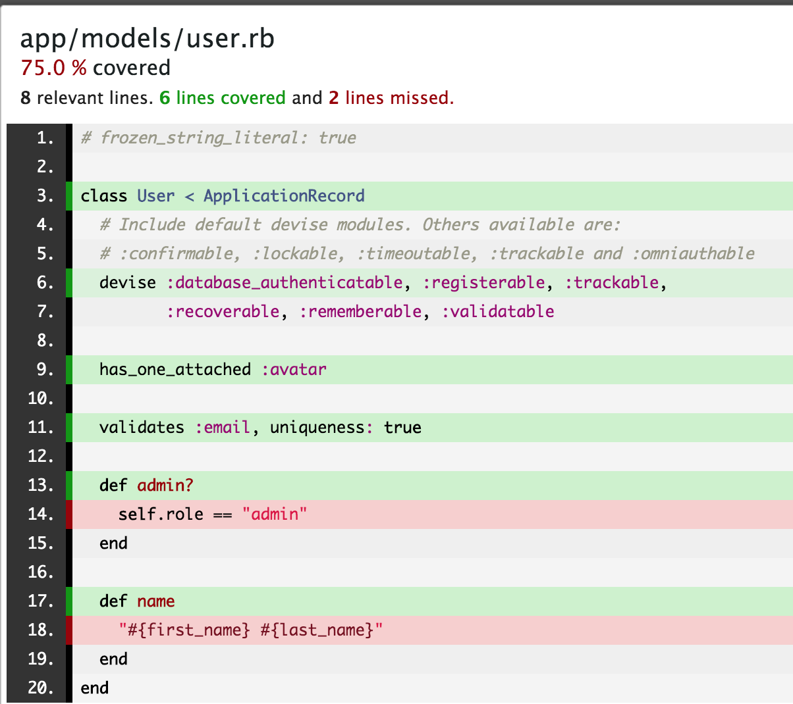

# Mutation testing in Ruby

### Amol Verma

Team Lead
株式会社メディ・ウェブ
(MediWeb, Inc.)

---

## Background: Unit testing (specifically, rspec)

```ruby
def weekend?(date)
  date.saturday? || date.sunday?
end
```

```ruby
describe 'weekend?' do
  subject { weekend?(date) }

  context 'for a Sunday' do
    let(:date) { Date.new(2023, 1, 15)) }
    it { is_expected.to be true }
  end

  context 'for a Monday' do
    let(:date) { Date.new(2023, 1, 16)) }
    it { is_expected.to be false }
  end
end
```

---

## Background: Code coverage

- A metric that helps us understand how much of our source code is tested

- Usually measured in the form of:
  - **Line coverage**: lines of source code executed during tests
  - **Branch coverage**: branches of control structures executed during tests

- Ruby: `simplecov` gem (example on next slide)

---



---

## The problem with (line-based) code coverage

- Tells us which lines of source code were executed by tests
- Does NOT tell us whether correctness of source code matters (example on next slide)

---

```ruby
def weekend?(date)
  date.saturday? || date.sunday?
end
```

```ruby
describe 'weekend?' do
  subject { weekend?(date) }

  context 'for a Sunday' do
    let(:date) { Date.new(2023, 1, 15)) }
    it { is_expected.to be true }
  end

  context 'for a Monday' do
    let(:date) { Date.new(2023, 1, 16)) }
    it { is_expected.to be false }
  end
end
```

👆 If we remove one of these tests, we still have 100% code coverage!
How can we tell if code correctness matters? This is where mutation testing comes in...

---

## What is mutation testing?

- The practice of modifying code in small ways to check if our tests can catch these changes
- Make small modifications to your code (“mutants”), and check if the tests fail for this modified version
- Kill mutants, and increase how much code correctness matters!

---

## Demo

---

## Pros

- Increases how much code correctness matters
- **Very effective** at eliminating certain classes of errors: `nil` handling, datatype errors, etc.
- Eliminating small errors like these prevents larger cascading errors
- Encourages you to think rigorously about how code works

---

## Cons

- Resource intensive
  - Development time
  - Computation
- Gives you less freedom to choose coding style (may be especially onerous for Rubyists)
- At what point do returns start to diminish?
  - `==` vs `.eql?` vs `.equal?`
  - `[0]` vs `.at(0)`

---


## Conducive usecases

- Projects that require highly robust code
- Inherited (legacy?) code with low test coverage
- Code with extensive unit tests
  - Gems ✅
- Rails
  - Models 😅
  - Controllers / requests 🥵
  - Views / features ☠️

---

## Things I wanted to talk about, but don't have the time to cover

- Incremental mutation testing
- mutant gem's licensing (free for OSS, $90/month/developer for commercial projects)
- Using mutant in CI

---

## Citations

- Simplecov image: https://github.com/simplecov-ruby/simplecov/issues/718
- Referred to https://accu.digital-medium.co.uk/wp-content/uploads/2022/04/Kill-All-Mutants-ACCU-BRISTOL.pdf for flow of ideas in presentation

---

## Acknowledgements

- Thanks to Paul McMahon for encouraging me to present, and for working on the skeleton of the presentation with me!
- Thanks to MediWeb and Yves-Eric Martin for letting me spend work time on learning and experimenting with things I'm interested in!

---

## Thank you!

Questions, comments, concerns, criticisms, complaints, queries? Contact me:

email: <email>
GitHub: amolverma
